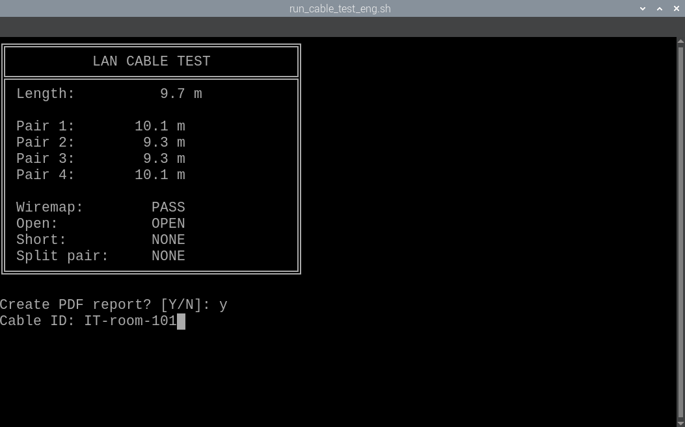
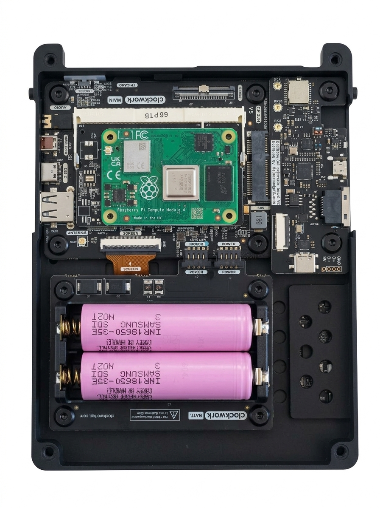
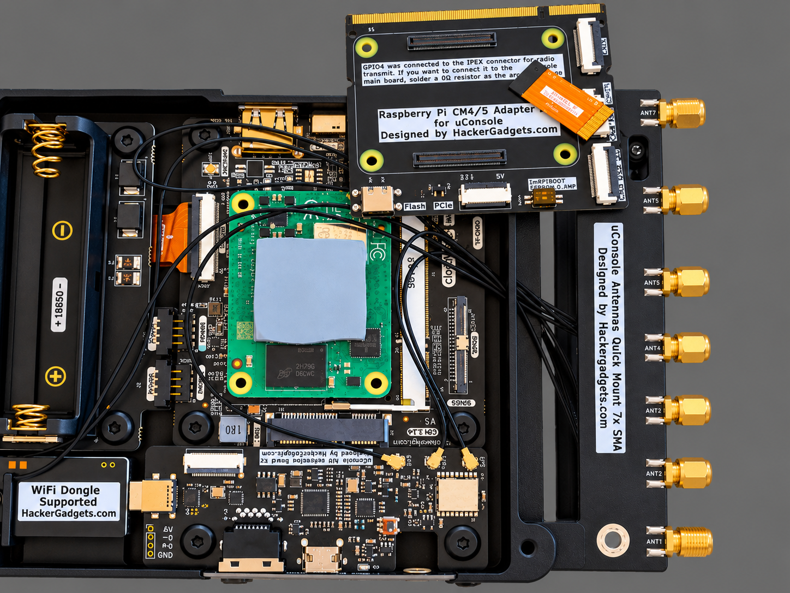
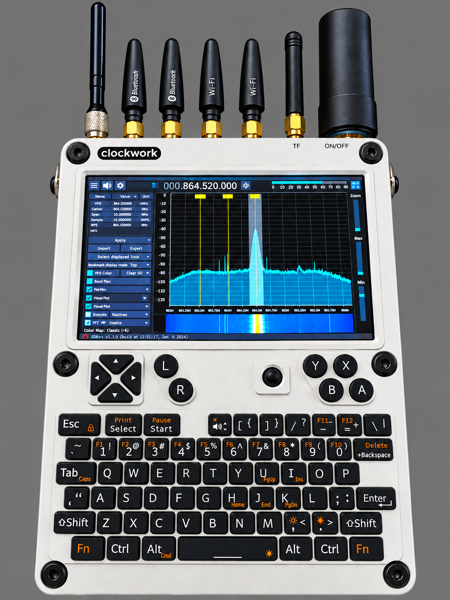
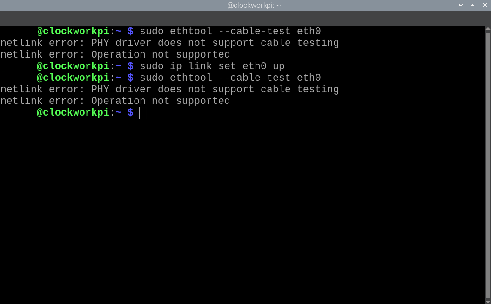
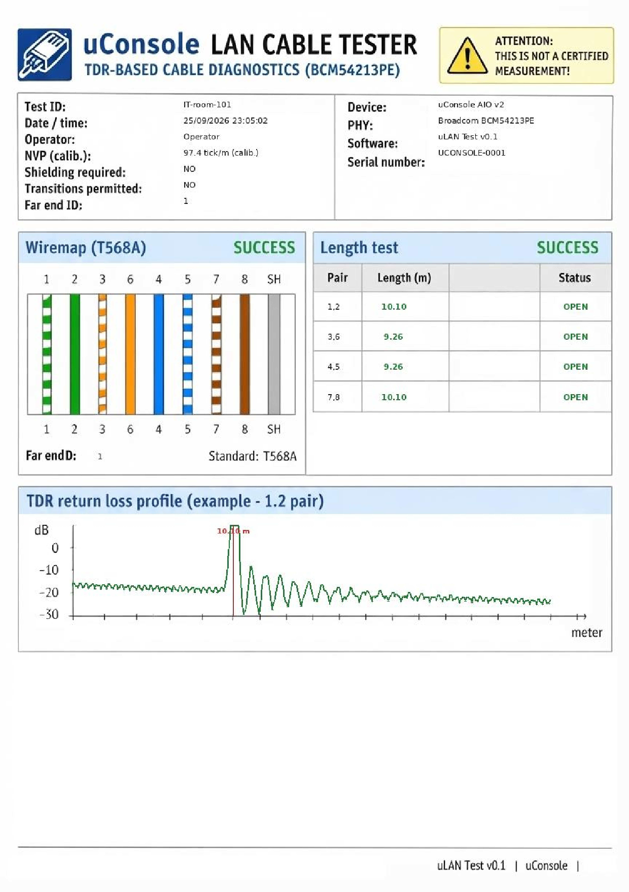

# uLAN Cable Tester

### Egy kis kábeltesztelő a uConsole-ba építve.



Mi lenne, ha a uConsole meg tudná mondani, körülbelül milyen hosszú egy LAN-kábel, akkor is, ha a másik végén semmi nincs csatlakoztatva?

Erről szól ez a projekt.

Az uLAN Cable Tester egy kísérleti Ethernet-kábeltesztelő, amely a ClockworkPi uConsole AIO v2 Ethernet hardverére épül.

Az egyes érpárok hosszát megbecsüli, alapvető bekötési hibákat képes felismerni, és akkor is tud mérni, amikor a kábel távoli vége egyszerűen szabadon marad.

És igen, a végeredmény meglepően használható.

De legyünk őszinték:

> Ez nem egy Fluke.

A hosszérték közelítő. A kalibráció kísérleti, az eredményt befolyásolja a kábel és a hardver, a PDF-ben látható grafika pedig elsősorban egy mérnöki szemléltetés – és egy kis geek szórakozás.

Érdemes úgy tekinteni rá, hogy több a semminél, de kevesebb egy professzionális kábelanalizátornál.

És ez teljesen rendben van.

A lényeg az, hogy tényleg működik.

---

## Mit tud?

- Egyenként megbecsüli a kábelpárok hosszát
- Alapvető bekötési / wire-map információt ad
- Többféle szakadás- és zárlatjellegű hibát képes felismerni
- Részletes PDF mérési jegyzőkönyvet készít
- Magyar és angol nyelven futtatható
- Lehetővé teszi az Ethernet hardver diagnosztikai képességeinek kísérleti használatát
- Az egész egy hordozható uConsole-ról futtatható

A kábel másik végén nem szükséges másik Ethernet-eszköznek lennie a diagnosztikai méréshez.

A kipróbálásához nincs szükség drága, különálló kábelteszterre – csak a megfelelő uConsole hardverre és némi kíváncsiságra, hogy mit lehet kihozni egy Ethernet chipből.

---

## Raspberry Pi 4 támogatás

A V2.0 verzió már Raspberry Pi 4-en is működik a **Broadcom BCM54213PE** PHY-val.

A Raspberry Pi 4 tesztelt konfigurációjában a PHY MDIO-címe `1`, míg a projekt eredeti uConsole konfigurációjában `0`. A mérési algoritmus nem változott; a natív MDIO segédprogramok és a mérési mag már kezelik a PHY-címet.

Raspberry Pi 4 esetén a mérés előtt:

```bash
export ULAN_PHY_ADDR=1
```

Ezután a szokásos módon indítható a mérés:

```bash
./run_cable_test_hu.sh
```

vagy:

```bash
./run_cable_test_eng.sh
```

Az uConsole esetén az alapértelmezett PHY-cím továbbra is `0`, ezért a meglévő működés változatlan marad.

A Raspberry Pi 4 támogatást valós kábelen végzett méréssel és PDF jegyzőkönyv generálásával ellenőriztem.

---

## Mielőtt elkezded

Két dolgot érdemes ellenőrizni még a telepítés előtt.

### 1. Megvan a szükséges uConsole hardver?

A projekthez a fejlesztés és tesztelés során használt **uConsole AIO v2 hardver, egy speciális CM4-kompatibilis csere-alaplap és a szükséges szalagkábel** szükséges.

Az eredeti uConsole alaplap önmagában nem elegendő ehhez a projekthez, és a szükséges szalagkábel sem csatlakoztatható hozzá.

Az alábbi hardverfotók megmutatják a használt konfigurációt.



### 2. A megfelelő Ethernet chip van a gépben?

Mielőtt bármit telepítenél, ellenőrizd, hogy a Linux milyen Ethernet PHY-t érzékel:

```bash
cat /sys/class/net/eth0/phydev/phy_id
```

A tesztelt hardveren ez az érték:

```text
0x600d84a2
```

Ez a projektben használt **Broadcom BCM54213PE** Ethernet PHY azonosítója.

Ha más értéket kapsz, ne feltételezd, hogy a teszter működni fog. A diagnosztikai regiszterek és a mérési folyamat az adott Ethernet PHY-hoz kötődik.

---

## A hardverkövetelmény

Itt különösen fontos az uConsole Ethernet hardvere. A projektet a **AIO v2 hardverrel, egy speciális CM4-kompatibilis csere-alaplappal és a szükséges szalagkábellel** fejlesztettem és teszteltem.

A szalagkábel az eredeti uConsole alaplaphoz nem csatlakoztatható. Ezért a CM4-kompatibilis csere-alaplap a működő hardverkonfiguráció kötelező része.

Ha a uConsole-ban nincs meg ez a hardverkonfiguráció, a szoftver telepítése önmagában nem fogja működőképessé tenni az Ethernet diagnosztikai funkciót.





> Hardvermegjegyzés: a dokumentáció a ténylegesen tesztelt hardverkonfigurációra épül. Más uConsole-revíziók vagy más Ethernet vezérlők eltérő szoftvert igényelhetnek, és itt nincsenek validálva.

---

## Hogyan működik?

A Linux hálózati rendszere ismeri az Ethernet PHY-t. Az `ethtool` segítségével elvileg kábeltesztet is kérhetünk:

```bash
sudo ethtool --cable-test eth0
```

A tesztelt hardveren azonban a szabványos interfész ezt válaszolja:

```text
netlink error: PHY driver does not support cable testing
```



Ezért a projekt a szabványos interfész alá megy, és közvetlenül az Ethernet PHY-val kommunikál **MDIO és kiterjesztett regiszterek** segítségével. Így olyan diagnosztikai információkhoz is hozzáfér, amelyeket a normál Linux interfész nem tesz elérhetővé.

A teszter elindítja a PHY ECD/TDR mérési folyamatát, kiolvassa a diagnosztikai értékeket, majd a projekt kísérleti kalibrációja alapján közelítő kábelhosszt számol.

---

## A jegyzőkönyv: hasznos, de egy kicsit geek is

A PDF tartalmazza a mérés adatait, az egyes érpárok eredményeit és a mérés szemléltető grafikáját.

A grafikon **nem nyers oszcilloszkópjel**, és nem szabad laboratóriumi pontosságú TDR-adatként értelmezni. A mért eredményből készített szemléltetésről van szó.

Magyarul: egy mérnöki kísérletet sikerült egy meglepően hivatalosnak tűnő PDF-be csomagolni.



---

## Kalibráció

A jelenlegi, tesztelt szoftver az alábbi kísérletileg meghatározott átváltási tényezőt használja:

```text
97.4 ticks / metre
```

Az értéket a tesztelt hardveren és kábel-konfiguráción végzett mérésekből határoztam meg. Ezért nem tekinthető minden BCM54213PE megoldásra érvényes univerzális állandónak.

A kijelzett kábelhossz így közelítő érték, nem hitelesített mérési eredmény.

---

## Telepítés

A teljes telepítési útmutató itt található:

**[Telepítési útmutató →](docs/INSTALL.md)**

Alapbeállítás Debian / Raspberry Pi jellegű Linux rendszeren:

```bash
sudo apt update
sudo apt install -y python3 python3-venv build-essential

python3 -m venv .venv
.venv/bin/pip install -r requirements.txt

chmod +x build.sh run_cable_test_hu.sh run_cable_test_eng.sh
./build.sh
```

Ezután futtatható:

```bash
./run_cable_test_hu.sh
```

vagy angolul:

```bash
./run_cable_test_eng.sh
```

A projekt tartalmazza a szükséges natív MDIO segédprogramok forrását és a `build.sh` segítségével újraépíthető binárisokat. A natív binárisokat az adott célrendszeren érdemes újraépíteni.

---

## Konfiguráció

A PDF jegyzőkönyvben megjelenő kezelői név itt állítható be:

```text
config/ulan_config.json
```

Példa:

```json
{
    "operator": "Operator"
}
```

A projektnek nincs szüksége felhasználóspecifikus home könyvtárra vagy fix helyi elérési útra.

---

## Projektfelépítés

```text
uLAN-Cable-Tester/
├── README.md
├── README.hu.md
├── LICENSE
├── build.sh
├── requirements.txt
├── run_cable_test_hu.sh
├── run_cable_test_eng.sh
├── src/
│   ├── cable_test_core.py
│   ├── cable_test_hu.py
│   ├── cable_test_eng.py
│   ├── generate_cable_report.py
│   ├── mdio_write.c
│   └── mdio_exp_read.c
├── bin/
│   ├── mdio_write
│   └── mdio_exp_read
├── templates/
├── config/
├── reports/
└── docs/
    └── INSTALL.md
```

A generált PDF jegyzőkönyveket a Git nem követi. A repositoryban üres `reports/` könyvtár marad, hogy a várt kimeneti hely klónozás után is rendelkezésre álljon.

---

## Korlátok

Ez a projekt **kísérleti hardver/szoftver projekt**, nem professzionális kábelminősítő műszer.

Fontosabb korlátok:

- a kábelhossz közelítő érték;
- a kalibráció kísérleti és hardver-/konfigurációfüggő;
- a PDF grafikon szemléltetés, nem nyers TDR hullámforma;
- a mérési folyamat a tesztelt BCM54213PE megvalósításhoz kötődik;
- más Ethernet PHY-k alapértelmezés szerint nem támogatottak;
- Linux és a projekt MDIO-hozzáférési módszere szükséges;
- hardver-, PHY- vagy alaplapverzió-váltás eltérő kalibrációt vagy szoftvermódosítást igényelhet.

Az eredményeket ezért jelzésként és diagnosztikai segítségként érdemes használni, nem hitelesített mérési adatként.

---

## A projekt támogatása

Ha hasznosnak vagy érdekesnek találod a projektet, vagy egyszerűen tetszik az ötlet, hogy egy kis Ethernet hardverből ilyen szokatlan kábeltesztelőt sikerült kihozni, támogathatod a fejlesztést.

Bármilyen összegű támogatást nagyra értékelek, legyen az akár csak néhány euró.

A támogatás segíti a további hardveres kísérleteket, fejlesztést, tesztelést és dokumentációt.

### ❤️ uLAN Cable Tester támogatása

**[Támogatás / Donation](https://github.com/sponsors/gali-master)**

Köszönöm!

---

## Affiliate tájékoztató

A projekthez kapcsolódó hardveres hivatkozások között lehetnek affiliate linkek. Ha ilyen linken keresztül vásárolsz, kis jutalékot kaphatok, neked pedig ez nem jelent többletköltséget.

A projekt dokumentációja és műszaki megállapításai a ténylegesen tesztelt hardveren alapulnak.

---

## Licenc

A projekt **MIT License** alatt érhető el.

A teljes licencszöveget a [LICENSE](LICENSE) fájl tartalmazza.
